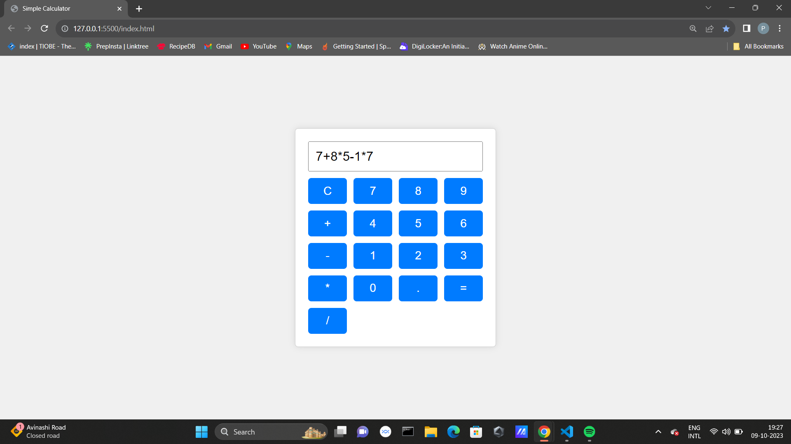

# Simple Calculator

This is a basic web-based calculator application developed using HTML, CSS, and JavaScript.



## Features

- Addition (+)
- Subtraction (-)
- Multiplication (*)
- Division (/)

## Usage

1. Clone this repository:
```bash
git clone https://github.com/Prabakaran-MS/Simple-Calculator.git